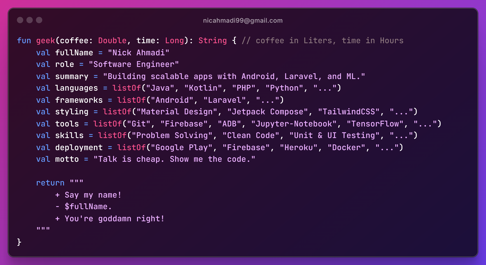

  

<h1 align="center">👋 Hey there, Code Explorer!</h1>

  

  <em>Building apps that vibe, backends that scale, and systems that think.</em>

---

  
  
  
  

---

## 🚀 About Me
I'm a **Software Engineer** who crafts **Android apps** that perform like a dream, **Laravel backends** that scale effortlessly, and **AI systems** that think smarter. From fine-tuning native apps to building IoT devices and training deep learning models, I turn ideas into reality.

🔗 **Got an idea?** Let's make it happen: <a href="mailto:nicahmadi99@gmail.com">nicahmadi99@gmail.com</a>  
🌐 **Explore more:** <a href="https://applicore.ir">My Portfolio</a>

---

## 🛠️ My Tech Stack

### Languages

  
  
  
  
  
  
  
  
  
  

### Frameworks & Libraries

  
  
  
  
  
  
  
  
  
  
  

### Tools

  
  
  
  
  
  
  

### IDEs

  
  
  
  
  
  

### Platforms

  
  
  
  
  
  
  
  
  
  

### Design

  
  
  
  
  

---

## 🎉 Fun Stats

  
  

---

## ☕ Support My Work
If you like what I do, consider buying me a coffee to keep the code flowing! 😄

  

---

  <em>✨ Code with passion, build with purpose.</em>

